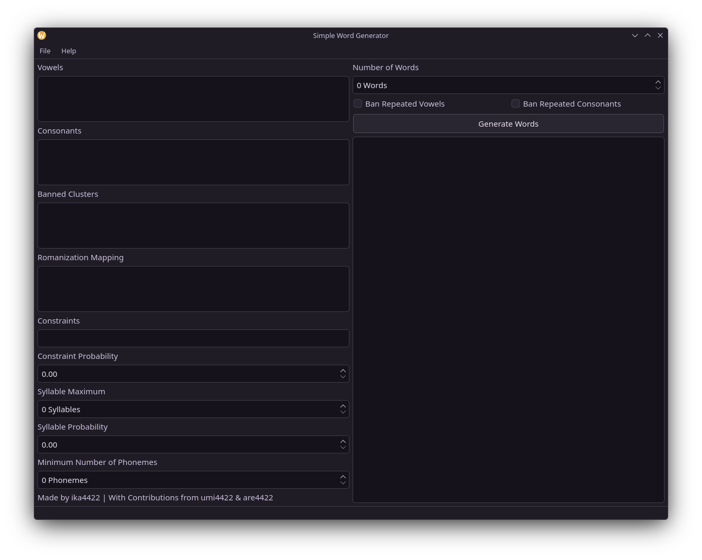
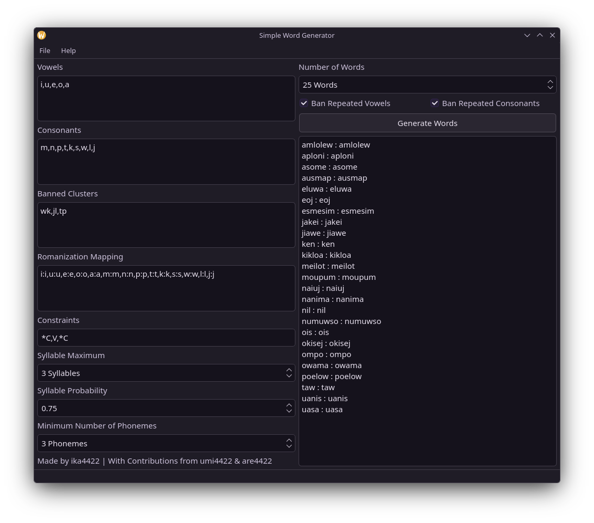

<h1 align="center">Simple Word Generator</h1>

An extremely simple to use but powerful word generator for linguistics and constructed language development made in Python with Pyside6.


<p align="center"><i>The appearance of the application will depend on your device, example images are taken on my own device which has custom Qt theming.</i></p>

## Installation
To install the tool simply clone the github repository:
```
git clone https://github.com/ika4422/simple-word-generator
```

This tool was developed on/for Python v3.13.7 and uses the Pyside6 library for the GUI. Any package requirements can be found in `requirements.txt`, and installed with the following command when in the project root directory.
```
pip install -r requirements.txt
```

## Usage
This tool is extremely easy to use and the following short guide will explain how each input field is formatted, saving/loading configuration files and exporting generated word lists.

### Vowels
This input field takes IPA vowels each separated by a comma, spaces and newlines can be used as they are ignored when the input is serialized, for example you could input `a, e, i, o, u`.

### Consonants
Identical to the [vowels](#vowels) input field apart from that it takes in your consonants as opposed to vowels, for example `m, n, p, t, k, s, w, l, j`.

### Banned Clusters
This field takes in any clusters of IPA symbols that should not be included in generated words, e.g. `kj, ma, nm`.

### Romanization Mapping
This field is optional, however if filled out will provide a romanized translation of the IPA, this field follows this form `IPA:Roman,IPA:ROMAN`, e.g. to write the IPA /a/ as "à" and /dʒ/ as "j" we would input `a:à,dʒ:j`.

### Constraints
Constraints are what determine the structure of a syllable, currently only V and C are supported class symbols (for consonant and vowel respectively) however additional class symbols may be added later.

The following symbols are used to define syllabic structure with each phoneme separated by commas when defining your syllabic structure:

Class Symbol | Meaning
-------------|--------
\*           |Optional phoneme
V            |Vowel
C            |Consonant

For example, `*C,V,C` defines a syllable as optionally having a starting vowel, always a vowel and always a final consonant.

### Constraints Probability
This determines the default probability for an optional phoneme to be included, a value of 0.0 means that no optional phonemes will be generated while one of 1.0 means that optional phonemes will always be generated.

### Syllable Maximum
This is the maximum number of syllables in generated words.

### Syllable Probability
This is the probability of a following syllable being generated, 0.0 meaning never and 1.0 meaning always.

### Minimum Number of Phonemes
The minimum number of phonemes in any generated words.

### Number of Words
This is how many words to generate and display in the output field.

### Ban Repeated Vowels/Consonants
Ticking either of these will append double vowels/consonants to the banned clusters list so that you don't have to manually define all of these yourself.

### Complete Example


### Save/Load Config
These can be selected under `File` on the menu bar or with the shortcuts `Ctrl + S`/`Ctrl + O`, they allow for loading or saving JSON configurations so that you don't have to fill out all the information every time you use the application. An example JSON configuration is below:
```JSON
{
  "vowels": "i,u,e,o,a",
  "consonants": "m,n,p,t,k,s,w,l,j",
  "bannedClusters": "wk,jl,tp",
  "romanizationMapping": "i:i,u:u,e:e,o:o,a:a,m:m,n:n,p:p,t:t,k:k,s:s,w:w,l:l,j:j",
  "constraints": "*C,V,*C",
  "syllableMaximum": 3,
  "syllableProbability": 0.75,
  "minimumPhonemes": 3,
  "numberWords": 25,
  "banRepeatVowels": false,
  "banRepeatConsonants": true
}
```

### Exporting a Word List
To save a generated word list you can export it with the option under `File` from the menu bar, you can save a word list as either .txt in the exact same format as used in the output field or as a .csv which splits the IPA and romanization into two separate columns.

## Licensing
Copyright © 2025 ika4422, licensed under [GNU GPLv3](https://choosealicense.com/licenses/gpl-3.0/).